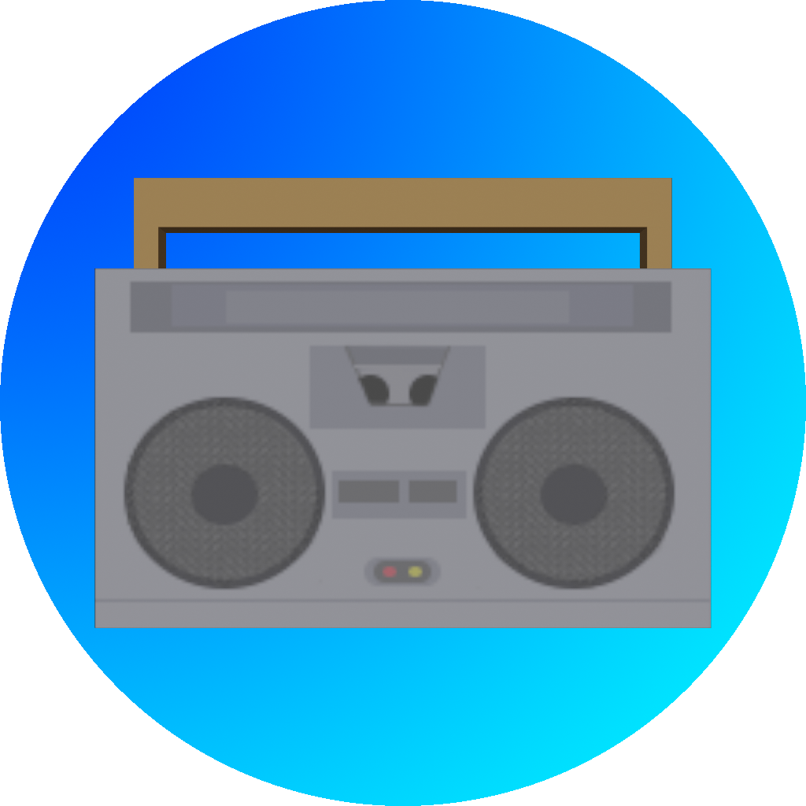
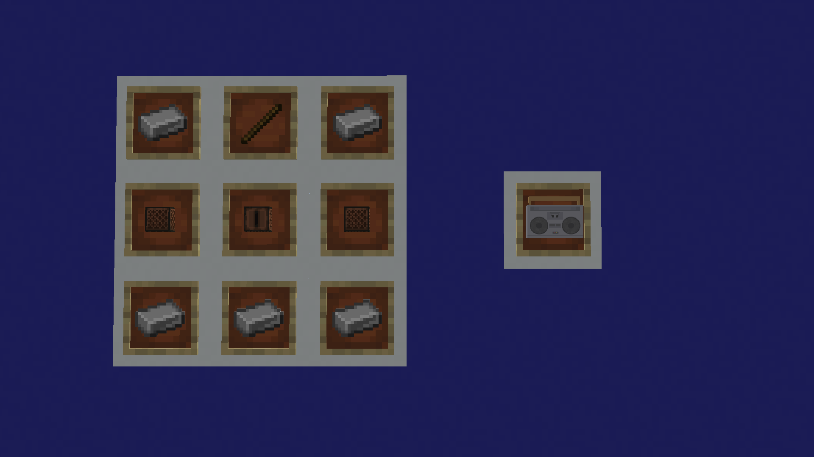

# Portable Music

## Ever wanted to bring the music with you? Well now you can!

Welcome to Portable Music! The mod that allows you to bring your music with you.

The mod is currently in beta, so there's a lot of work left to do, but the core concept is done.

The mod adds a Boombox block/item in which you can put any Minecraft disc (for now) and you can choose to play, stop or pause the music.

Right-clicking the block opens the screen where you can place the disc and control the music.

When holding the Boombox item in hand you can press `B` to open the same screen.

## Recipes

### Boombox

Resources needed:
 - 5x Iron Ingot
 - 2x Note Block
 - 1x Jukebox
 - 1x Stick
